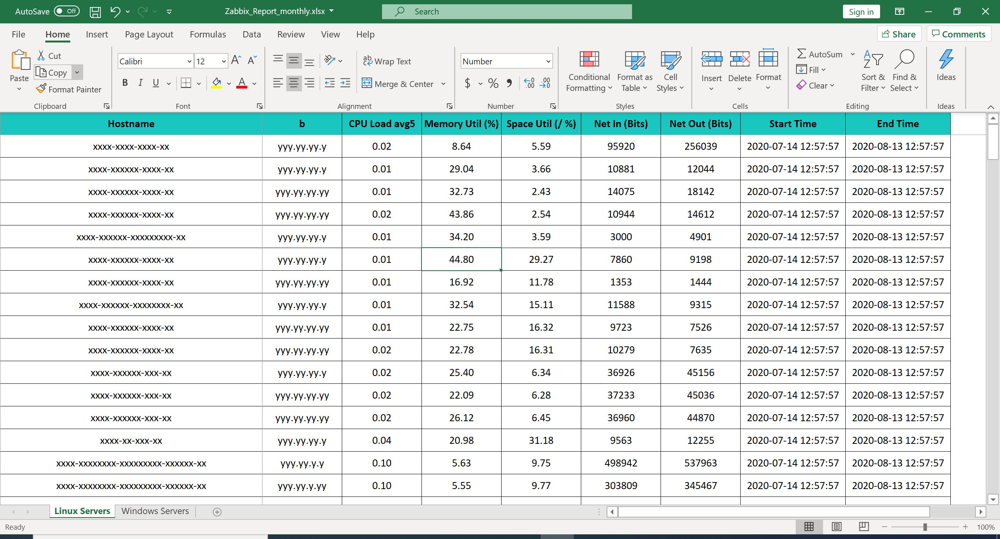

### What is this repository for? ###

Get history and trend data via Zabbix api and generate Excel report.

Tested in Zabbix 4.4

Replace ApiUrl, user and password before run the script.
```
ApiUrl = 'https://{replace this}/zabbix/api_jsonrpc.php'
user="{replace this}"
password="{replace this}"
```

Script auto discovery host which linked to below Zabbix Template.
- "Template OS Linux by Zabbix agent active"
- "Template OS Windows by Zabbix agent active"

Linux items:
 - system.cpu.load[all,avg5]
 - vm.memory.size[pavailable]
 - vfs.fs.size[/,pused]
 - net.if.in[\"e*\"]
 - net.if.out[\"e*\"]


Windows items:
 - system.cpu.util
 - vm.memory.util
 - vfs.fs.size[C:,pused]
 - net.if.in["Amazon Elastic Network Adapter"]
 - net.if.out["Amazon Elastic Network Adapter"]


 Report Example:
 
Format: 
